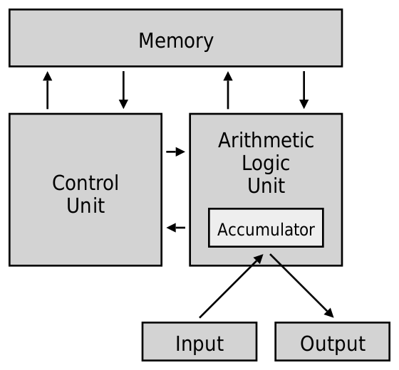
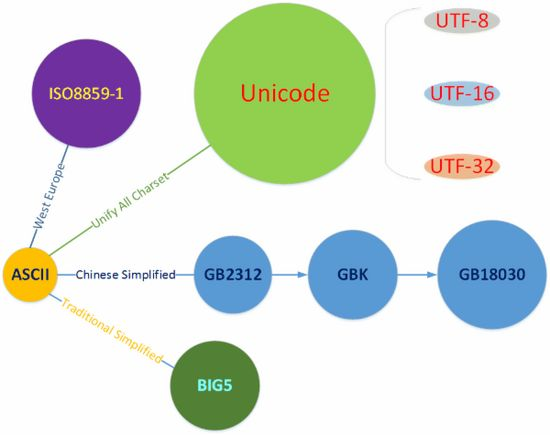

# 目录
- [目录](#目录)
- [0. 序言](#0-序言)
  - [0.1 条件检查](#01-条件检查)
  - [0.2 本书的适用人群](#02-本书的适用人群)
  - [0.3 本书的特色](#03-本书的特色)
  - [0.4 本书的使用方法](#04-本书的使用方法)
- [1. 编程导论](#1-编程导论)
- [2. 常识](#2-常识)
  - [2.1. 计算机基础](#21-计算机基础)
    - [2.1.1 计算机组成](#211-计算机组成)
    - [2.1.2 控制台、终端、Shell等易混淆概念](#212-控制台终端shell等易混淆概念)
    - [2.1.3 数据格式和编码](#213-数据格式和编码)
    - [2.1.4 计算机程序](#214-计算机程序)
  - [2.2 编程语言基础](#22-编程语言基础)
    - [2.2.1 编译型语言和解释型语言](#221-编译型语言和解释型语言)
    - [2.2.2 编程语言的实现](#222-编程语言的实现)
- [3. 从C++开始](#3-从c开始)
  - [3.1 万物起源「Hello World」](#31-万物起源hello-world)
    - [3.1.1 头文件](#311-头文件)
    - [3.1.2 主函数](#312-主函数)
    - [3.1.2 注释](#312-注释)
    - [3.1.3 命名空间](#313-命名空间)
    - [3.1.4 输入和输出](#314-输入和输出)
    - [习题](#习题)
      - [习题 3.1-1](#习题-31-1)
  - [3.2 基础数据类型和变量](#32-基础数据类型和变量)
      - [习题 3.2-1](#习题-32-1)
- [-1. 结语](#-1-结语)
  - [-1.1 编者的话](#-11-编者的话)


# 0. 序言
本书为NSFZ2023级开发者社教材，旨在帮助读者从零开始学习编程。它将从基础语法、数据类型、流程控制、函数、面向对象编程等方面进行讲解，并结合大量的实例，帮助读者快速掌握编程技能，同时对编程的思想逐步建立理解。
（也可以在[此处](https://github.com/NSFZ-Developers/club-textbook-2023/blob/main/textbook.md)线上阅读）

## 0.1 条件检查
1. 您已满**中华人民共和国法律规定的10周岁**。
2. 您认为您能在[韦克斯勒儿童智力量检测四](https://baike.baidu.com/item/%E9%9F%A6%E6%B0%8F%E5%84%BF%E7%AB%A5%E6%99%BA%E5%8A%9B%E9%87%8F%E8%A1%A8/11069197)中达到正常水平（约80分）。
3. 您没有**令人费解的语言逻辑缺陷**。
4. 您拥有一台**尚可正常开机的**，**外设齐全的个人电脑**。
5. 上述电脑**工作正常**，并**搭载主流操作系统**，一般是Windows（视窗操作系统）。
6. 您的电脑**RAM**大小≥4GB。（RAM的概念见#2.1.1章节）

## 0.2 本书的适用人群
这本书适用于所有想要学习编程的人（~~以及真的愿意花钱弄一本这玩意的实体书的人~~）。无论你是完全没有编程基础的初学者，还是想~~不太~~系统地老年复健的满级巨佬，都可以从本书中获益。

## 0.3 本书的特色
本书的特色主要体现在以下几个方面：

- **注重实用性**：本书的所有内容都以实用为导向，重点讲解与实际应用相关的知识点。
- **循序渐进和突然跳级**：本书将编程知识分为多个阶段进行讲解，循序渐进，让读者能够轻松掌握，并且穿插跳级内容，使读者时刻认识到学无止境。
- **巨™多代码量**：本书配有大量的代码示例，帮助读者理解和应用编程知识。

## 0.4 本书的使用方法
本书可以作为一本自学教程，也可以作为编程课程的辅助教材（~~最好别~~）。如果是自学，建议读者按照书中的章节顺序进行学习，并结合书中的代码示例进行练习。如果是使用本书作为编程课程的辅助教材，建议读者在课堂上认真听讲，并结合本书的内容进行巩固。


# 1. 编程导论
> 程序不过是更详细的需求罢了
> ——沃·兹基·硕德

众所周知，程序是由一条条指令构成的。每一条指令都是电脑的一个基本动作，如“使屏幕上某一个像素点变成某种颜色”，或是“将某个电路接口设置为高/低电平”。人们负责给出这些指令，由计算机**按顺序**完成这一系列指令，便可以达到理想的效果。然而，这里的指令不免过于基本。这时，人们会将用于实现某种功能的一系列指令捆绑在一起，形成一个较基本指令更为高级、简介、实用的指令，这就是编程中一个重要的思想：抽象。抽象思想使得人们避免一些无意义的重复劳动，但这又引入了一个新的问题：计算机不像人拥有如此先进的思想，它实际上只能完成那些最基本的指令，因此我们需要一个工具，将这些利于人们使用的高级指令翻译回计算机能够完成的底层的基础指令。这个工具就是人们使用的各类语言的编译器、解释器等。

因此，编程本质上就是提出需求的过程，需求的简洁程度与抽象程度呈正相关。同时我们可以给出编程的一般过程，即“人类提出需求->工具将抽象的需求翻译为基础指令->计算机执行这些基础指令”。

需要指出的是，本章中使用了大量不准确的说法，目的是便于理解其中的思想，当读者阅读完第二章后，可以对本章内容进行规范化的整合。


# 2. 常识
> 在门外和门内之间，有一个小小的门槛
> ——沃·兹基·硕德

这些内容并不像编程语言的内容等对编程起决定性作用，但它们也是编程中时常会接触到的东西，初学编程的一部分时间总是在了解这些知识上，因此不妨先学习这些内容，再去进行实际编程的学习。

## 2.1. 计算机基础
### 2.1.1 计算机组成
一般来说，计算机有五大组成部分：
- 控制器
- 运算器
- 存储器
- 输入设备
- 输出设备

其中控制器负责控制所有硬件的运行，其他都很好理解，这里不再解释。值得注意的是，存储器分为内部存储和外部存储，后者为常见的硬盘，软盘等，而前者又分为随机存储器（RAM）、只读存储器（ROM）和其他一些存储器。

这里借用维基百科上的一张图片，可以很好的展示这五个部分之间的关系。


前文所说的五大组成部分是逻辑结构，而计算机的实际结构又包含以下几部分：
- 中央处理单元（CPU）
- 图形处理单元（GPU）
- 主板、固件等硬件
- 键盘、屏幕等输入、输出设备

其中CPU对应逻辑结构中的控制器和运算器，是这两个逻辑结构的实现形式。
CPU有几个重要的性能指标，如主频和位宽。主频是描述CPU执行指令速度的量，它的单位即为频率的单位。位宽是CPU在一条指令中可以处理的二进制数据位数，例如32bit、64bit。
CPU有多种不同的实现形式，也就是架构和指令集。常见的架构有ARM系列、x86系列、MIPS系列和PowerPC系列。ARM架构的优势有价格低、能耗低，因此常用于嵌入式开发和手机等。x86架构的优势有兼容性强、性能高，常用于个人计算机。
关于CPU更详细的介绍可以参考以下文章：
https://zhuanlan.zhihu.com/p/245119254
https://zhuanlan.zhihu.com/p/508557771

我们日常生活中所使用的电脑一般是个人计算机（PC），它是计算机的一个主要的子集。按照层级来梳理，个人计算机的层级从底向上依次是硬件、操作系统、应用程序，其中操作系统和应用程序合称软件。在不引起歧义的情况下，有时软件也可仅指应用程序。主流的操作系统有Windows、Ubuntu、CentOS、Alpine等，它们的设计理念有所不同，但对于计算机的作用是类似的，即与硬件直接交互，为程序提供抽象的较高级的接口。

### 2.1.2 控制台、终端、Shell等易混淆概念
这些名词来源于大型机时代的一个个实体的设备，它们可能由不同的专业人员专职负责管理，到了今天，所有这些东西都在一台小巧的电脑里，但是由于惊人的历史遗留性，它们都被保留了下来（尽管是虚拟的），于是造成了如此混乱的体系。总的来说，它们可以分为两层：
1. 控制台、终端、串口终端：属于计算机五大组成部分的输入/输出设备，可以将用户指令（包括键盘事件）输入给操作系统并将操作系统返回的结果输出给用户（显示字符）。电传打字机（tty）是这类设备的具体实例。在现代计算机中，虚拟的终端被称为终端模拟器。特别的，终端模拟器在UNIX/Linux内核的驱动程序模块中为伪终端（pty）。
2. Shell：属于应用程序，负责解析、处理、运行命令，常见的Bash、Zsh、sh属于此类。

Windows系统中内置的命令提示符（CMD）和PowerShell，是终端和Shell的集合体，因为它们既处理输入/输出事件，也负责执行命令。也可以理解为它们是由终端和Shell两个独立的部分组成的。~~编者甚至觉得没有必要纠结这些模糊的概念性的东西~~
一般情况下，编程语言编写的程序使用其输入/输出模块与Shell直接交互。

### 2.1.3 数据格式和编码
我们知道，任何数据在计算机中都是以二进制的形式存储的。在操作系统中，数据以文件的形式被组织起来。那么，操作系统或程序是如何将这些文件中的数据（从底层上来说，都是二进制数据）识别为一张图片、一个文档、或是一份代码呢？这就需要数据格式。操作系统依靠文件的一些特殊信息（一般称为元数据）来识别文件的类型。一般有以下几种识别的方式：
- 扩展名：即文件名最后一个`.`之后的内容，在Windows系统中，文件的默认打开方式与扩展名绑定。利用文件名识别的特性使得它易于更改，这既是优点也是缺点。由于扩展名没有官方统一的规定，不同类型的文件可能会使用相同的扩展名，从而在Windows系统中默认打开方式无法很好地分辨。
- 特征签名：即文件头部几个字节的数据，它通常与文件中数据的组织形式强相关。它不易被更改（因为更改后会影响特定程序的读取），所以较扩展名更为可靠。

在很多时候，扩展名和特征签名会同时使用，因为它们被使用的时机和对象不同，存储的位置也不同。

对于一个文本文件，我们有更细致的需求，即将文件中的二进制数据识别为人类可读的，可以显示在屏幕上的字符。这时我们需要建议一个从二进制数据到字符的双向映射，于是就有了字符集。常用的字符集如下：
- ASCII（美国信息交换标准代码）：用一个字节表示一个字符，最初其二进制最高位始终是0，即只能表示128中字符，其中包括大小写字母、一些符号和控制字符。
- ISO8859-1（Latin1）：用一个字节表示一个字符，是对ASCII的扩展，增加了西欧语言、希腊语、泰语、阿拉伯语、希伯来语的符号。但是，由于出现得较晚，欧元符号没有被收录于其中。
- GB2312：1980年中国公布的国家标准，用两个字节表示一个字符，共收录6763个汉字，同时收录了包括拉丁字母、 希腊字母、日文平假名及片假名字母、俄语在内的682个字符
- GBK：用两个字节表示一个字符，在兼容ASCII和GB2312的情况下可以表示的汉字达到了20902个，还有984个汉语标点符号、部首等，其中还包括繁体字。
- GB18030：用四个字节表示一个字符，在兼容以上字符集的情况下新增了大量字符，最新的GB18030-2022标准中收录的汉字达到了87887个，甚至包含了少数民族汉字。
- Unicode（万国码）：用四个字节表示一个字符，由美国加州的Unicode组织提出。Unicode的出现标志着字符集和字符编码的彻底分离，前文的几个既是字符集也是字符编码，而Unicode仅仅是字符集，其常用的字符编码有UTF-8、UTF-16等。

由于Unicode的独特设计，使得它可以包含世界上所有字符。借用CSDN上的一张图片总结：



关于这些字符集的具体编码方式可以参考这篇文章 https://blog.csdn.net/wn084/article/details/80363792

### 2.1.4 计算机程序
可以直接运行在操作系统中的程序，即本机程序，一般是一个二进制文件，其内容包括实际指令、预定义数据等。大多数还包含导入表，如果程序中调用了操作系统中或是其他程序中的代码，那么需要导入表来标示代码的位置。
还有一类文件和本机程序的表现类似，例如在Windows系统下，如果安装了Python环境，那么可以直接双击一个`.py`文件来运行它，就像本机程序一样。但实际上这类文件并不是一个真正的程序，而是与它的运行环境绑定后得以实现的功能，即让另一个本机程序来解释这个文件的内容。其原理与直接打开一个`.docx`文档相同。

## 2.2 编程语言基础
### 2.2.1 编译型语言和解释型语言
上一节末尾，我们提到了本机程序和另一种类似本机程序的文件（姑且叫做非本机程序），由此可以引出编程语言的两大阵营：编译型语言和解释型语言。编译型语言的最终产物是一个本机程序，解释型语言的最终产物是一个非本机程序。之所以叫做解释型语言，就是因为在编写完成后，需要另一个本机程序来解释它运行。将编译型语言的代码翻译为本机程序的一个特殊的本机程序，是编译器工具链（编译器及其周边组件，如链接器，稍后会详细介绍）。解释解释型语言的代码运行的本机程序，是解释器。编译器和解释器其实都是第一章中所说的那个将高级指令翻译回基础指令的工具。

常见的编译型语言有C、C++、Rust等，常见的解释型语言有Python、JavaScript等。虚拟机语言如C#/.NET、Java/JVM，介于编译型和解释型语言之间，它们的分类仍是个有争议的话题，但多数人将其归为解释型语言。由此可见，编译型语言和解释型语言的分类并不是完全清晰的。
关于虚拟机语言的扩展内容可以参考这篇文章 https://www.iteye.com/blog/rednaxelafx-492667

不难发现，编译型语言更加本质化，所以我们先介绍它。将编译型语言的代码翻译为本机程序是一个复杂的操作，以C++语言为例，它的编译过程如下：
1. 预处理（Preprocess）：预处理器会对源代码进行操作，包括展开一些简写的代码，引入其他文件等。
2. 编译（Compilation）：编译器将预处理后的源代码文件转换为目标代码，通常是汇编语言代码。编译器会进行语法检查，如果程序有语法错误，那么会报出错误（Error）和警告（Warning）.
3. 汇编（Assemble）：汇编过程将汇编代码转换成机器码，产生的文件叫做目标文件，是二进制格式。汇编过程需要为每一个源文件产生一个目标文件。
4. 链接（Link）：链接器将目标文件组织起来，生成可执行文件。链接器会解析目标文件中的符号，将符号引用与符号定义关联起来，生成可执行文件.

解释型语言的运行过程是一个“模拟”的过程，即在运行时，解释器实时地根据代码执行相应的指令。可以这么理解：解释器作为一个本机程序，其中包含了解释型语言所有可能的代码所对应的的基本指令，运行代码时，解释器就根据代码找到对应的基本指令来执行。

### 2.2.2 编程语言的实现
由于编程语言通常只是一个标准，一套规范，它的具体实现依靠不同的编译器或解释器。对于编译型语言来说，不同编译器的差异无非在于其实现编程语言标准之外的扩展内容。如果一份编译型语言的代码完全符合语言标准，那么它理应可以被任何符合规范的编译器编译。解释型语言的不同解释器差异很大，本质上是因为运行的过程就是解释的过程，即解释器和代码在运行时是绑定且相互依靠的。

以典型解释型语言C++为例，它的编译器工具链有以下几种：
- GCC工具链：全称为GNU Compiler Collection，顾名思义，它可以处理C++、Objective-C、Go等语言，它包含预处理器/编译器cc1、汇编程序as、连接器ld（collect2）等工具。它是大多数信息学竞赛的官方编译器工具链，因此广为人知。
- Clang/LLVM工具链：分为前端Clang和后端LLVM（这里指狭义LLVM，广义LLVM包含前端、优化器和后端，Clang是LLVM前端的一种），Clang将C++代码解析为统一的中间代码（IR），LLVM优化器负责优化IR，再交由后端生成本机代码。
- MSVC工具链：微软出品的工具链，通常用于开发Windows应用，它依靠Windows SDK，如果把MSVC理解为工具的话，那么SDK更偏向于工具所需要的物料。

以典型解释型语言Python为例，它的解释器有以下几种：
- CPython：Python官方默认的解释器，由C语言编写，它可以将Python代码编译为中间产物CPython字节码，再解释执行字节码。
- PyPy：著名的CPython替代品，由Python语言编写（事实上是RPython，Python语言的子集，去除了动态类型，详见第四章），它使用即时编译技术（JIT），可以在运行时将 Python 代码动态地编译成机器码，从而提供更高的执行速度，但它与许多使用C语言编写的Python拓展库不兼容，并且由于JIT，它的启动速度较慢。
- Stackless Python：一种 Python 的变体，它是在CPython的基础上进行扩展和改进的版本，提供了一些额外的特征。
- Jython：即Java Python，由Java语言编写。它运行在Java虚拟机（JVM，与下文.NET虚拟机同类，类似于解释器）上，因此提供了与Java的无缝集成。
- IronPython：运行在.NET虚拟机上，它可以与.NET平台无缝集成。


# 3. 从C++开始
> There are only two kinds of languages: the ones people complain about and the ones nobody uses.
> ——Bjarne Stroustrup

## 3.1 万物起源「Hello World」
> 你说的对，但是「C++」是由Bjarne Strou-strup自主研发的一款全新开放世界冒险游戏。  
> ——Anonymous

众所周知，学一门编程语言很显然要学习它的基础。「Hello World」是其一个非常经典的例子。
考虑以下代码。
``` cpp
// helloworld.cpp (A hello world example for dummies)

#include <iostream>

int main() {
    // print "hello world"
    std::cout << "Hello world" << std::endl;
    return 0;
}
```
对以上代码稍作修改，可以**充分**体验到C++的魅力。例如：
``` cpp
// helloworld2.cpp (An example use of std::cout)

#include <iostream>

int main() {
    std::cout << "You're right, " << "\n";
    std::cout << "but" << "the C++ programming language" << "is a new, open-world adventure game solely developed by Bjarne Strou-strup" << std::endl;
    return 0;
}
```
……也就是本节的引言。

本节会介绍这个最基本的程序中的内容。（类似于第一章编程导论，为了易于理解、快速上手，本节也使用了不规范的说法）

### 3.1.1 头文件
C++中有许多内置的头文件，它们包含了C++标准库中的函数、类型等。可以用`#include`来引入它们。特别的，`#include <...>`会使得编译器在内部目录查找文件，`#include "..."`会使得编译器在用户定义的目录下查找文件（一般是源文件同级目录）。下面是部分常用的头文件和它们所包含的内容：
|    头文件     |             内容                |
|:------------:|:-------------------------------:|
| `<iostream>` |          输入/输出流             |
|  `<fstream>` |             文件流               |
|  `<iomanip>` |        输入/输出流控制符         |
|  `<cstdlib>` | 动态内存分配、随机数等常用函数和类 |
|   `<cmath>`  |       数学相关函数和常量          |

在C++中，以`#`开头的语句是给编译器看的，也就是说，并不会存在于编译出来的程序中。

### 3.1.2 主函数
主函数是C++程序的入口（_entry point_），即程序从这里开始执行。在标准的C++语言中必须返回int类型。函数的内容用两个花括号括起来。约定俗成的，在没有错误的情况下，程序总应返回整数0（`return 0;`）。

### 3.1.2 注释
在C++中，可以在代码中插入注释，这些注释不会影响编译和运行，但可以用来描述代码，让开发者（~~包括自己~~）获得更好的阅读体验。下面是单行注释和多行注释的示例：
``` cpp
// This is a single-line comment.
/*
This is a
multiline
comment.
*/
```

### 3.1.3 命名空间
命名空间用于处理命名冲突问题，即如果代码中需要出现两个同名函数，那么可以将它们至于不同的命名空间中，再用`namespace1::function()`和`namespace2::function()`来调用。定义一个命名空间的格式如下：
``` cpp
namespace ns {
    // ...
}
```
特别的，C++标准库中的大部分内容都在`std`命名空间中。
如果确保一份代码中不会存在命名冲突的问题，可以使用`using namespace std;`来引入命名空间，从而在之后的代码中不需使用`std::`前缀。~~虽然笔者不建议引入命名空间，尤其是std（你永远也不知道标准库里有什么）~~

### 3.1.4 输入和输出
传统C++采用“及其先进”的流式输入输出，具体来说，使用控制台输出流（std::cout）和输出流运算符（<<）来进行输出，使用控制台输入流（std::cin）和输入流运算符（>>）来进行输入。输入或输出运算符可以连用，即可以使用`std::cout << var1 << var2;`的方式依次输出两个值。类似的，可以使用`std::cin >> var1 >> var2;`的方式依次输入两个值（一般情况下，以不可见字符空格、换行符、制表符Tab等分割）显然，一条语句不能既输入又输出，所以输入和输出流运算符不能连接使用。
C++标准库中包含多种输入/输出流控制元素，例如可以通过输出`std::endl`来进行换行。

### 习题
为了帮助读者巩固知识，从本节开始，每节末尾都会有相关习题，参考答案可以在代码仓库找到。
#### 习题 3.1-1
编写一段 _C++_ 程序，使得此程序输出以下内容。~~（经典老题）~~
``` text
I love playing
Genshin
Impact
```

## 3.2 基础数据类型和变量
众所周知，程序最初就是用来计算的，在数学中，为了简化计算，或是重复利用已经计算的结果，我们常常会使用一些符号来表示具体数值。在编程中，我们也会定义一些变量代替具体值。编程中的变量较数学更为广泛，因为它可以表示数值，也可以表示字符、字符串，甚至是自定义的东西。在编程语言中，数据都是和类型相绑定的，一般来说，基础数据类型有以下几种：
- 整数（Integer）：与数学中的整数定义相同，因为二进制整数与十进制整数总是可以互相转换，所以不存在精度问题。在C++中，整数类型分为有符号整数（signed）和无符号整数（unsigned）两类。按照数据长度分类，可以分为16位（short）、32位（long）、64位（long long）。有符号整数可以表示的数的范围为$ [-2^{n-1}, 2^{n-1}-1] $，无符号整数可以表示的数的范围为$ [0, 2^n-1] $，其中n为数据长度（二进制位数）。整数类型的类型名组成为`(符号限定符) (长度限定符) (int)`，其中符号限定符默认为`signed`，长度限定符默认为`long`，所以`int`表示32为有符号整数（在一些古老的机器上，`int`也可能表示16位有符号整数）。符号限定符、长度限定符和`int`三者至少出现一个。~~（这不废话吗，都没了还算什么类型名）~~
- 浮点数（Float）：即小数，由于二进制小数与十进制小数不一定能恰好互相转换，所以存在浮点误差。单精度浮点（float）和双精度浮点（double）分别能表示7位和15位十进制有效数字。笔者测试得到下表。（测试代码见代码仓库）

  |    类型     |  二进制位数 | 有效数字（十进制位数） |                     数值范围                    |
  | :---------: | :--------: | :------------------: | :--------------------------------------------: |
  |    float    |     32     |          6~7         |    $[\pm1.17549*10^{-38},\pm3.40282*10^{38}]$  |
  |   double    |     64     |         15~16        |  $[\pm2.22507*10^{-308},\pm1.79769*10^{308}]$  |
  | long double |    128     |         18~19        |  $[\pm3.3621*10^{-4932},\pm1.18973*10^{4932}]$ |
- 字符（Character）：符合ASCII标准的字符，占用1个字节，类型名为`char`。值得一提的是，为了支持国际化，C++还有宽字符类型`wchar_t`等类型。
- 布尔值（Boolean）：仅能表示真（true）、假（false）两个值，但仍占用1个字节，因为计算机中最小的单位为字节。
- 指针（Pointer）：表示一个内存地址，因此其大小与去除指针后的类型大小无关，仅与程序位数有关，如32位程序的指针大小为4字节，64位程序的指针大小为8字节。

C++的类型系统中包含非常多的基础类型，这里只介绍了常用的一部分，更多信息可参考https://zh.cppreference.com/w/cpp/language/types

作为一门较为底层的语言，C++是静态类型的语言，即一个变量一旦定义好了，就只能表示这一个类型的值。同时它是可变的（mutable），除非在类型名前加上类型修饰符`const`使其成为常量。定义变量的语法为`(类型修饰符) 类型名 变量名;`，如`int x;`。之后可以用赋值运算符`=`对变量进行赋值操作：`x = 100;`。也可以在定义时同时进行赋值，如`int x = 100;`，还可以写成`int x{100};`，这两种的区别会在面向对象相关章节提到。还可以在一条语句中定义两个变量，如`int a = 1, b = 2;`。需要注意的是，赋值运算符是有返回值的，其返回赋值之后被赋值的变量的引用（引用将在之后的章节中介绍，这里可以暂时忽略，理解为被赋值的变量），并且它是右结合的，即从右向左运算，所以连续使用赋值运算符，如`a = b = c;`等价于`b = c; a = b;`两条语句。
C++标准对标识符（变量名、函数名、类型名等）有一定要求，可以是小写字母、大写字母、数字和下划线的组合，并且第一个字符不能是数字。~~但现在甚至似乎可以用中文~~
直接出现在代码中的值称为字面量（literal），如`100`、`123.45`。一般编译器会自动推导字面量的类型，我们也可以通过字面量后缀手动指定类型，常见的后缀有`l`（long）、`ul`（unsigned long）、`ll`（long long）、`ull`（unsigned long long）、`f`（float）、`lf`（double）、`llf`（long double）等。特别的，可以通过字面量前缀来指定数值类型的进制，常见的有`0x`（16进制）、`0`（8进制）、`0b`（2进制，C++14及以后）。

C++的数值类型变量和字面量都可以进行运算，与数学运算类似。特别的，两个整数进行除法操作时为整除，如果需要正常的除法，需要将其转换为浮点数再进行运算。除了常见的加减乘除运算符（`+-*/`），还有一个常用的整数间运算符为取余`%`。一般的，可以将赋值运算符和其他运算符结合，构成自操作运算符，例如`a = a + b;`可以改写为`a += b;`。当多个运算符同时使用时，运算符优先级规则，可以使用添加小括号的方式改变优先级。优先级顺序和结合性参考 https://zh.cppreference.com/w/cpp/language/operator_precedence

#### 习题 3.2-1
编写一段 _C++_ 程序，使其计算并输出一个三边长为12、13、14的三角形的面积的平方。提示：使用海伦公式（$S=\sqrt{p(p-a)(p-b)(p-c)},\space p=\frac{a+b+c}{2}$）。

# -1. 结语
编程是一项需要不断学习和实践的技能。希望读者能够通过本书掌握编程的基本技能，并在未来的学习和工作中有所收获。

## -1.1 编者的话
在编写本书的过程中，参考了大量优秀的编程教材和资源。同时也结合了自己的学习经验，希望能够为读者提供一本系统、实用、易学的编程教材。

在本书的编写过程中，编者得到了许多人的帮助，在此向他们表示衷心的感谢。

最后，祝愿读者在编程学习的道路上取得成功！